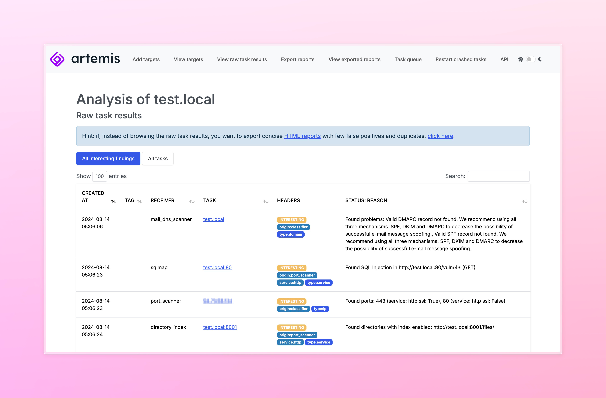

<h1>
    <picture>
        <source media="(prefers-color-scheme: dark)" srcset="static/images/logo_dark.png">
        
    </picture>
</h1>

Artemis is a modular vulnerability scanner. It's the tool that powers CERT PL scanning activities by
[checking various aspects of website security](https://artemis-scanner.readthedocs.io/en/latest/features.html)
and [building easy-to-read messages ready to be sent to the scanned organizations](https://artemis-scanner.readthedocs.io/en/latest/generating-reports.html).

## [Quick Start 🔨](https://artemis-scanner.readthedocs.io/en/latest/quick-start.html) | [Docs 📚](https://artemis-scanner.readthedocs.io/en/latest/)

If you want to use additional modules that weren't included here due to non-BSD-compatible licenses, browse to the [Artemis-modules-extra](https://github.com/CERT-Polska/Artemis-modules-extra) repository.

If you want to modify/develop Artemis, read **[Development](#development)** first.

**Artemis is experimental software, under active development - use at your own risk.**

To chat about Artemis, join the Discord server:

[](https://discord.gg/GfUW4mZmy9)

## Cooperation and conferences
<div style="margin-bottom: 5px">
    
</div>

Artemis was presented at BlackHat USA 2024 in Las Vegas. For more information about Artemis at BlackHat USA [click here](https://www.blackhat.com/us-24/arsenal/schedule/index.html#artemis-modular-vulnerability-scanner-with-automatic-report-generation-39372).

<br/>

<div style="margin-bottom: 5px">
    
</div>

The project was also presented at the [71st TF-CSIRT Meeting in Copenhagen](https://tf-csirt.org/tf-csirt/meetings/71st/), [69th TF-CSIRT Meeting in Bucharest](https://tf-csirt.org/tf-csirt/meetings/69th/) and the [CONFidence](https://confidence-conference.org/) conference, among others.

### Cooperation


Artemis development was supported by Google Summer of Code 2024.

## Features
For an up-to-date list of features, please refer to [the documentation](https://artemis-scanner.readthedocs.io/en/latest/features.html).
The most important one is the possibility to [easily export](https://artemis-scanner.readthedocs.io/en/latest/generating-reports.html) reports such as:

> The following addresses contain version control system data:
>
> - https://subdomain1.example.com:443/.git/
>
> Making a code repository public may allow an attacker to learn the inner workings of a system, and if it contains passwords or API keys - also gain unauthorized access. Such data shouldn't be publicly available.
>
> The following addresses contain old Joomla versions:
>
> - https://subdomain2.example.com:443 - Joomla 2.5.4
>
> If a site is no longer used, we recommend shutting it down to eliminate the risk of exploitation of known vulnerabilities in older Joomla versions. Otherwise, we recommend regular Joomla core and plugin updates.

The possibility to automatically prepare such reports enabled us to notify entities in our constituency about [hundreds of thousands](https://cert.pl/en/posts/2024/01/artemis-security-scanner/) of vulnerabilities.

## Screenshots


<a name="development"></a>
## Development
To start a locally modified version of Artemis, run:
```commandline
 ./scripts/start_dev
```
This script automatically copies the example environment file (env.example) to .env if it doesn't exist. You can then configure the settings in the .env file according to your needs. This includes customizing the user-agent by setting the CUSTOM_USER_AGENT variable, as well as other relevant parameters. For a complete list of configuration variables and their descriptions, please refer to the [Configuration section in the documentation](https://artemis-scanner.readthedocs.io/en/latest/user-guide/configuration.html).

The Artemis image is then built locally (from the code you are developing) not downloaded from Docker Hub.
For `web`, you will also be able to see the results of code modifications on the page without reloading the entire container.

### Tests
To run the tests, use:

```console
./scripts/test
```

### Code formatting
Artemis uses `pre-commit` to run linters and format the code.
`pre-commit` is executed on CI to verify that the code is formatted properly.

To run it locally, use:

```console
pre-commit run --all-files
```

To set up `pre-commit` so that it runs before each commit, use:

```console
pre-commit install
```

### Building the docs

To build the documentation, use:

```console
cd docs
python3 -m venv venv
. venv/bin/activate
pip install -r requirements.txt
make html
```

## How do I write my own module?

Please refer to [the documentation](https://artemis-scanner.readthedocs.io/en/latest/user-guide/writing-a-module.html).

## Contributing
Contributions are welcome! We will appreciate both ideas for new Artemis modules (added as [GitHub issues](https://github.com/CERT-Polska/Artemis/issues)) as well as pull requests with new modules or code improvements.

However obvious it may seem we kindly remind you that by contributing to Artemis you agree that the BSD 3-Clause License shall apply to your input automatically, without the need for any additional declarations to be made.

## Contributors
Huge thanks to the following people that contributed to Artemis development, especially the [KN Cyber](https://kncyber.pl/) science club of [Warsaw University of Technology](https://pw.edu.pl) that initiated the project!


<!-- ALL-CONTRIBUTORS-LIST:START - Do not remove or modify this section -->
<!-- prettier-ignore-start -->
<!-- markdownlint-disable -->
<table>
  <tbody>
    <tr>
      <td align="center" valign="top" width="14.28%"><a href="https://github.com/kazet"><br /><sub><b>kazet</b></sub></a><br /><a href="https://github.com/CERT-Polska/Artemis/commits?author=kazet" title="Code">💻</a> <a href="https://github.com/CERT-Polska/Artemis/commits?author=kazet" title="Documentation">📖</a> <a href="#ideas-kazet" title="Ideas, Planning, & Feedback">🤔</a> <a href="#infra-kazet" title="Infrastructure (Hosting, Build-Tools, etc)">🚇</a> <a href="https://github.com/CERT-Polska/Artemis/pulls?q=is%3Apr+reviewed-by%3Akazet" title="Reviewed Pull Requests">👀</a> <a href="#talk-kazet" title="Talks">📢</a></td>
      <td align="center" valign="top" width="14.28%"><a href="https://github.com/BonusPlay"><br /><sub><b>Adam Kliś</b></sub></a><br /><a href="#question-BonusPlay" title="Answering Questions">💬</a> <a href="https://github.com/CERT-Polska/Artemis/commits?author=BonusPlay" title="Code">💻</a> <a href="#ideas-BonusPlay" title="Ideas, Planning, & Feedback">🤔</a> <a href="https://github.com/CERT-Polska/Artemis/pulls?q=is%3Apr+reviewed-by%3ABonusPlay" title="Reviewed Pull Requests">👀</a> <a href="#talk-BonusPlay" title="Talks">📢</a></td>
      <td align="center" valign="top" width="14.28%"><a href="https://github.com/anna1492"><br /><sub><b>anna1492</b></sub></a><br /><a href="https://github.com/CERT-Polska/Artemis/issues?q=author%3Aanna1492" title="Bug reports">🐛</a> <a href="https://github.com/CERT-Polska/Artemis/commits?author=anna1492" title="Code">💻</a></td>
      <td align="center" valign="top" width="14.28%"><a href="https://github.com/ELOOLE"><br /><sub><b>Michał M.</b></sub></a><br /><a href="https://github.com/CERT-Polska/Artemis/commits?author=ELOOLE" title="Code">💻</a> <a href="#ideas-ELOOLE" title="Ideas, Planning, & Feedback">🤔</a></td>
      <td align="center" valign="top" width="14.28%"><a href="https://github.com/cyberamt"><br /><sub><b>cyberamt</b></sub></a><br /><a href="https://github.com/CERT-Polska/Artemis/commits?author=cyberamt" title="Code">💻</a> <a href="#ideas-cyberamt" title="Ideas, Planning, & Feedback">🤔</a></td>
      <td align="center" valign="top" width="14.28%"><a href="https://github.com/martclau"><br /><sub><b>martclau</b></sub></a><br /><a href="https://github.com/CERT-Polska/Artemis/commits?author=martclau" title="Code">💻</a> <a href="#ideas-martclau" title="Ideas, Planning, & Feedback">🤔</a></td>
      <td align="center" valign="top" width="14.28%"><a href="https://github.com/szymsid"><br /><sub><b>szymsid</b></sub></a><br /><a href="https://github.com/CERT-Polska/Artemis/commits?author=szymsid" title="Code">💻</a> <a href="https://github.com/CERT-Polska/Artemis/pulls?q=is%3Apr+reviewed-by%3Aszymsid" title="Reviewed Pull Requests">👀</a></td>
    </tr>
    <tr>
      <td align="center" valign="top" width="14.28%"><a href="https://github.com/bulkowy"><br /><sub><b>bulek</b></sub></a><br /><a href="https://github.com/CERT-Polska/Artemis/commits?author=bulkowy" title="Code">💻</a> <a href="https://github.com/CERT-Polska/Artemis/pulls?q=is%3Apr+reviewed-by%3Abulkowy" title="Reviewed Pull Requests">👀</a></td>
      <td align="center" valign="top" width="14.28%"><a href="https://github.com/mimi89999"><br /><sub><b>Michel Le Bihan</b></sub></a><br /><a href="https://github.com/CERT-Polska/Artemis/commits?author=mimi89999" title="Code">💻</a></td>
      <td align="center" valign="top" width="14.28%"><a href="https://eliszewski.pl/"><br /><sub><b>Grzegorz Eliszewski</b></sub></a><br /><a href="https://github.com/CERT-Polska/Artemis/commits?author=es1o" title="Code">💻</a> <a href="#ideas-es1o" title="Ideas, Planning, & Feedback">🤔</a> <a href="#platform-es1o" title="Packaging/porting to new platform">📦</a></td>
      <td align="center" valign="top" width="14.28%"><a href="https://github.com/kshitijk4poor"><br /><sub><b>kshitij kapoor</b></sub></a><br /><a href="https://github.com/CERT-Polska/Artemis/commits?author=kshitijk4poor" title="Code">💻</a> <a href="#ideas-kshitijk4poor" title="Ideas, Planning, & Feedback">🤔</a></td>
      <td align="center" valign="top" width="14.28%"><a href="https://github.com/DelfinSR"><br /><sub><b>Delfin</b></sub></a><br /><a href="https://github.com/CERT-Polska/Artemis/commits?author=DelfinSR" title="Code">💻</a></td>
      <td align="center" valign="top" width="14.28%"><a href="https://bornunique911.github.io/"><br /><sub><b>Bornunique911</b></sub></a><br /><a href="https://github.com/CERT-Polska/Artemis/commits?author=Bornunique911" title="Code">💻</a></td>
      <td align="center" valign="top" width="14.28%"><a href="https://github.com/RasenRhino"><br /><sub><b>Ridham Bhagat</b></sub></a><br /><a href="https://github.com/CERT-Polska/Artemis/commits?author=RasenRhino" title="Code">💻</a></td>
    </tr>
    <tr>
      <td align="center" valign="top" width="14.28%"><a href="https://github.com/Matie26"><br /><sub><b>Mateusz Borkowski</b></sub></a><br /><a href="https://github.com/CERT-Polska/Artemis/commits?author=Matie26" title="Code">💻</a> <a href="#ideas-Matie26" title="Ideas, Planning, & Feedback">🤔</a></td>
      <td align="center" valign="top" width="14.28%"><a href="https://github.com/jxdv"><br /><sub><b>jxdv</b></sub></a><br /><a href="https://github.com/CERT-Polska/Artemis/commits?author=jxdv" title="Code">💻</a></td>
      <td align="center" valign="top" width="14.28%"><a href="https://github.com/michalkrzem"><br /><sub><b>kvothe</b></sub></a><br /><a href="https://github.com/CERT-Polska/Artemis/commits?author=michalkrzem" title="Code">💻</a> <a href="#ideas-michalkrzem" title="Ideas, Planning, & Feedback">🤔</a></td>
      <td align="center" valign="top" width="14.28%"><a href="https://github.com/lukigruszka"><br /><sub><b>lukigruszka</b></sub></a><br /><a href="https://github.com/CERT-Polska/Artemis/commits?author=lukigruszka" title="Code">💻</a></td>
      <td align="center" valign="top" width="14.28%"><a href="https://github.com/dr4g0n369"><br /><sub><b>Abhinav Karn</b></sub></a><br /><a href="https://github.com/CERT-Polska/Artemis/commits?author=dr4g0n369" title="Code">💻</a></td>
    </tr>
  </tbody>
</table>

<!-- markdownlint-restore -->
<!-- prettier-ignore-end -->

<!-- ALL-CONTRIBUTORS-LIST:END -->
