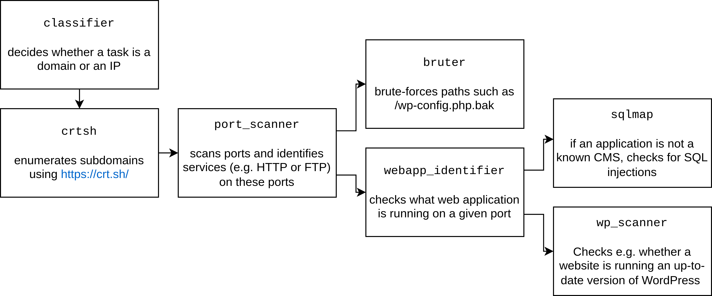

Artemis architecture
--------------------

Artemis is based on the `Karton framework <https://github.com/CERT-Polska/karton>`_ and various scanning features are implemented by specialized Karton modules. Each module can:

- accept tasks (for example: a domain),
- perform some actions (for example: enumerate subdomains using https://crt.sh/),
- and produce other tasks (for example: produce new subdomains).

This way, the scanning can be:

- decomposed into small tasks that are performed in parallel,
- easily extended with new modules.

The following diagram describes the flow of tasks through a small subset of Artemis modules:

You can view the full list of Artemis modules on:

- https://github.com/CERT-Polska/Artemis/tree/main/artemis/modules (the core modules),
- https://github.com/CERT-Polska/Artemis-modules-extra (the modules that, due to licensing reasons, couldn't have been included in core).
