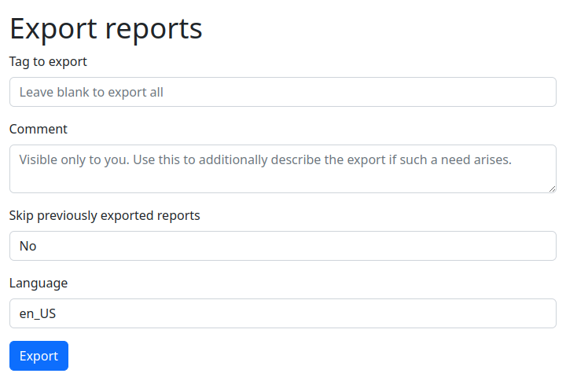

.. _generating-reports:

Generating reports to be sent
=============================
Artemis can generate HTML reports containing a description of
found vulnerabilities. An example report can be found in the :ref:`generating-reports-example-report` section.

Such reports are sent by CERT PL via e-mail to the scanned entities in our constituency.

These reports won't contain everything found by Artemis - custom logic (residing in
``artemis/reporting/modules/``) will make an educated guess whether a vulnerability
is a true positive and interesting enough to be reported.

To generate such reports, you first need to start Artemis and scan some targets, as described in :doc:`quick-start`.

Then, click Export in the top navigation bar and configure how you want the data to be exported:

This tool will produce **HTML messages ready to be sent** - you will be able to download them as a ``.zip`` file.

You may also translate the reports. If your language is not
supported or you want to edit the translations, please refer to
:doc:`user-guide/translating-report-messages`.

Besides the messages, the script will also produce additional files in the ``advanced/`` directory in the ``.zip`` file: a JSON file with vulnerability data, a
jinja2 template and a .po translation file - using these three files you can build the messages yourself.

.. note ::
   Please keep in mind that the reporting tool resolves domains and performs HTTP requests.

Troubleshooting
^^^^^^^^^^^^^^^
The report generation module has custom logic that makes an educated guess whether a vulnerability
is a true positive and interesting enough to be reported. If you don't see a vulnerability in the reports
or if you see that no messages have been generated:

.. code-block:: none

  Reports total: 0

You can browse to http://127.0.0.1:5000/results?task_filter=interesting to see everything found by Artemis.
If you see a problem that you consider severe enough to be reported, file a bug or submit a PR that includes
this type of vulnerabilities in the reports.

.. _generating-reports-example-report:

Example vulnerability report generated by Artemis
^^^^^^^^^^^^^^^^^^^^^^^^^^^^^^^^^^^^^^^^^^^^^^^^^

.. highlights::

  1. The following addresses contain version control system data:

    - https://subdomain1.example.com:443/.git/

    Making a code repository public may allow an attacker to learn the inner workings of a system, and if it contains passwords or
    API keys - also gain unauthorized access. Such data shouldn’t be publicly available.

  2. The following addresses contain old Joomla versions:

    - https://subdomain2.example.com:443 - Joomla 2.5.4

    If a site is no longer used, we recommend shutting it down to eliminate the risk of exploitation of known vulnerabilities in older
    Joomla versions. Otherwise, we recommend regular Joomla core and plugin updates.

  3. The following domains don't have properly configured e-mail sender verification mechanisms:

    - example.com: Valid SPF record not found
    - example.com: Valid DMARC record not found

    Such configuration may allow an attacker to send spoofed e-mail messages from these domains.
