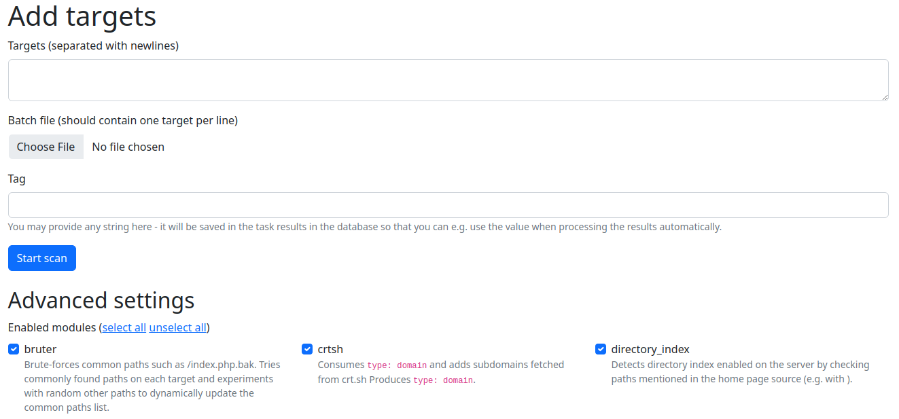
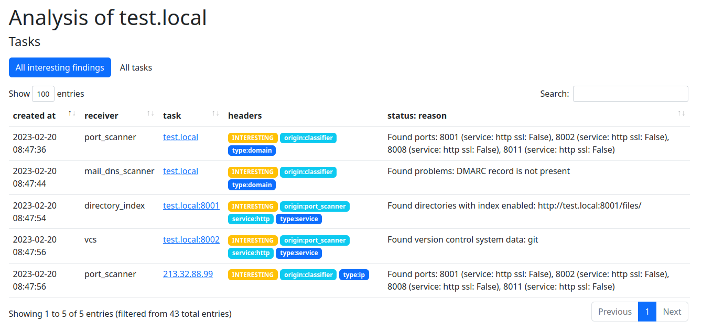

Quick Start
===========

Currently, only Docker Compose based deployment is supported.

Using Docker Compose
--------------------
First, you need to prepare a machine. The recommended configuration for the scanning machine is:

- 16GB of RAM,
- 2 cores,
- 30GB of free disk space to store Docker images and scan results.

To start Artemis, clone the ``https://github.com/CERT-Polska/Artemis/`` repository and execute the
following command in your terminal in the ``Artemis`` directory:

.. code-block:: console

   ./scripts/start

After that you should be able to access the Artemis dashboard at ``localhost:5000``.

The above command will automatically create a ``.env`` file with default settings if it doesn't exist. You can edit this file later to configure various settings, including customizing the user-agent by setting the ``CUSTOM_USER_AGENT`` variable, as well as other relevant parameters.

We strongly recommend setting the ``CUSTOM_USER_AGENT`` and configuring rate-limiting for scanning (more information here: :doc:`user-guide/cooperation-with-scanned-entities`). For a complete list of configuration variables and their descriptions, please refer to the :doc:`user-guide/configuration` section in the documentation.

**We recommend you to add additional Artemis modules from** https://github.com/CERT-Polska/Artemis-modules-extra/ -
these modules haven't been included in core due to licensing reasons, but provide additional features such
as e.g. SSL verification (certificate validity, proper redirect, etc.), subdomain takeover check or
SQL injection check.

To do that, clone https://github.com/CERT-Polska/Artemis-modules-extra/ **inside
the Artemis directory** and run ``./scripts/start``.

.. note ::

   Artemis exposes port 5000 that can be used to add tasks and view results. Remember that this port
   shouldn't be available publicly, but e.g. on an internal network.

   To add authorization (or SSL termination), you may for example use a reverse proxy, e.g. nginx.

**If you want to increase the number of instances of a module to speed up scanning, modify the numbers of instances in** ``./scripts/start``
(e.g. by changing ``--scale=karton-bruter=5`` to ``--scale=karton-bruter=20``). By default
some modules are spawned in a couple of instances, but you may want more of them.

For the full list of available configuration options you may set in the ``.env`` file, see :doc:`user-guide/configuration`.

.. note ::
   If you get an error that ``docker compose`` is not a valid command, that means that Docker Compose
   plugin is not installed. Please follow the instructions from https://docs.docker.com/compose/install/linux/#install-using-the-repository

   The old ``docker-compose`` syntax is not recommended.

Adding targets to scan
----------------------
To add targets to be scanned, select ``Add targets`` from the top navigation bar. Artemis takes input
in the form of entries separated with newlines. Artemis works with both IPs and domains. It also supports
IP ranges, both in the form of `127.0.0.1-127.0.0.10` or `127.0.0.0/30` and `host:port` syntax - in the latter
case, no port scanning will be performed.

To be later able to filter various types of targets, provide a tag in the `Tag` field. You may
also choose what modules will be executed, to increase scanning speed if you need only to check for
a subset of vulnerabilities.

Viewing results
---------------
To view results, click the ``View results`` link in the top navigation bar:

Exporting reports
-----------------
Besides viewing the raw results, you may want to generate HTML reports containing
descriptions of found vulnerabilities, so thay you can notify the administrators to get
the vulnerabilities fixed.

To do that, please refer to :ref:`generating-reports`.

Stopping Artemis
----------------
To turn off Artemis (without removing the scan results and pending tasks), use:

.. code-block:: console

   ./scripts/run_docker_compose down

To remove all data, use:

.. code-block:: console

   ./scripts/run_docker_compose down --volumes
